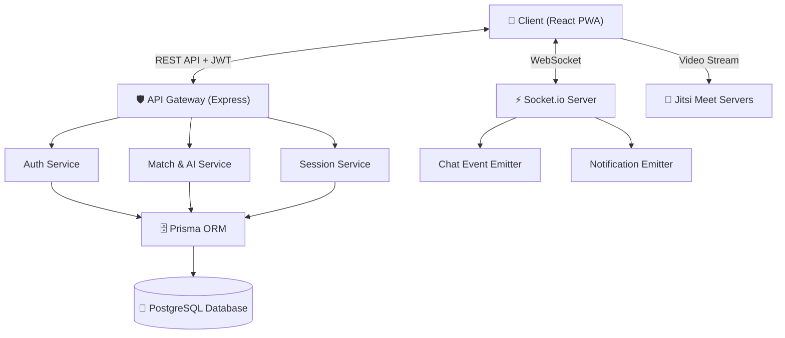
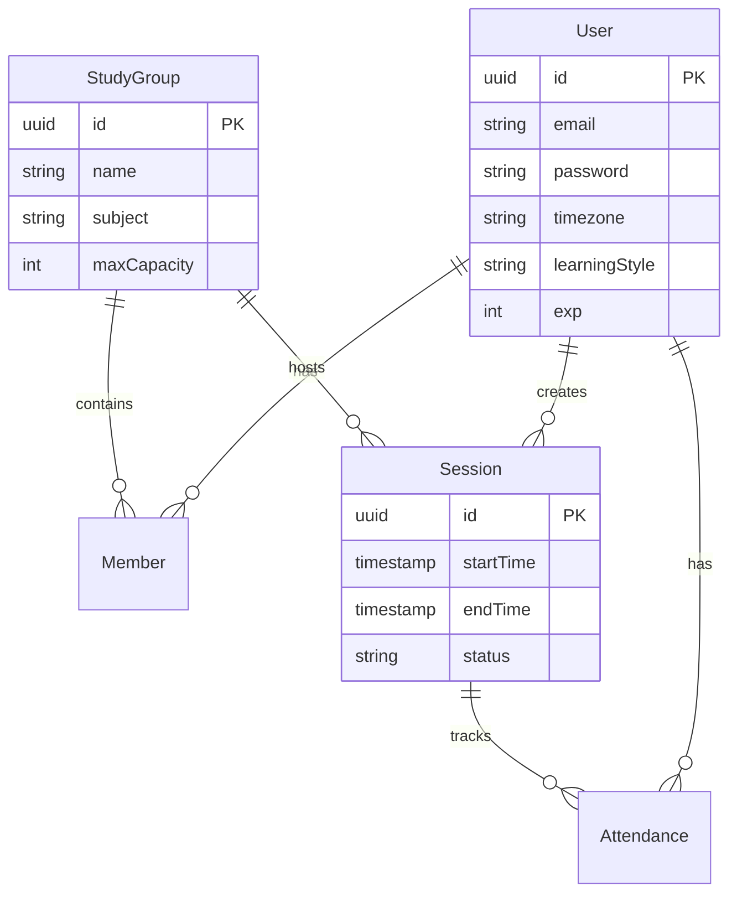

<div align="center">
  
  
  # StudyCircle 🎓✨

  **Platform Koordinasi Study Group Bertenaga AI & Real-Time Collaboration**

  [](#)
  [](#)
  [](#)
  [](#)
  [](#)
  [](#)
  [](#)
  [](#)
  
  <br />
  <i>Tugas Mata Kuliah Pemrograman Web Lanjutan - Universitas Hasanuddin</i>
</div>

<br />

> **StudyCircle** adalah platform kolaborasi edukatif berskala *enterprise* yang memecahkan masalah inefisiensi dalam pembentukan kelompok belajar. Dengan mengimplementasikan arsitektur *event-driven* latensi rendah dan algoritma *heuristic scoring*, aplikasi ini menjembatani mahasiswa lintas zona waktu untuk menemukan rekan belajar yang ideal, mengatur jadwal optimal secara otomatis, dan berkolaborasi di dalam *virtual room* yang terintegrasi penuh.

---

## 📑 Daftar Isi
- [👥 Tim Pengembang](#-tim-pengembang)
- [✨ Core Features & Technical Implementation](#-core-features--technical-implementation)
- [📐 System Architecture](#-system-architecture)
- [🗄️ Database Schema](#️-database-schema)
- [📂 Struktur Direktori (Monorepo)](#-struktur-direktori-monorepo)
- [🌐 REST API Endpoints](#-rest-api-endpoints)
- [🚀 Panduan Instalasi Lokal](#-panduan-instalasi-lokal)
- [🧪 Testing & Deployment](#-testing--deployment)

---

## 👥 Tim Pengembang

Proyek ini dirancang secara komprehensif mengikuti siklus SDLC (*Software Development Life Cycle*) modern oleh Kelompok 4:

| Nama | NIM | Tanggung Jawab & Spesialisasi |
| :--- | :--- | :--- |
| **Imam Dzaqhoir** | `H071241048` | **Fullstack Engineer & AI Integrator**<br/>Merancang logika bisnis *backend*, implementasi JWT *Auth*, integrasi Socket.io, dan mendesain algoritma komputasi *heuristic matching* serta *scheduling*. |
| **Muh. Hanif Nurmahdin** | `H071241033` | **Frontend Developer & UI/UX Designer**<br/>Membangun antarmuka PWA responsif menggunakan React 19 & Tailwind v4, mengimplementasi *glassmorphism*, dan merancang alur UX (*User Experience*) yang intuitif. |
| **Haris** | `H071241070` | **Backend Developer & Database Architect**<br/>Mendesain skema basis data PostgreSQL, relasi entitas via Prisma ORM, normalisasi data, serta optimalisasi kueri (*query optimization*). |

---

## ✨ Core Features & Technical Implementation

### 1. 🤖 Algoritma Heuristic Matching & AI Scheduling
- **Weighted Group Matching**: Berjalan di *service layer backend*, algoritma ini mengevaluasi setiap *study group* terhadap profil pengguna. Skor kecocokan dikalkulasi menggunakan bobot: `Learning Style Match (50%)`, `Timezone Proximity (30%)`, dan `Capacity Availability (20%)`.
- **Intersection Scheduling**: Menghitung *Time-to-UTC* seluruh anggota grup secara dinamis dan mencari celah waktu bersinggungan (*intersection windows*) tertinggi. Sistem mengembalikan 3 opsi waktu pertemuan paling rasional (*Confidence Score > 80%*).

### 2. 🎥 Integrasi Jitsi WebRTC (Virtual Study Room)
- **Iframe Sandboxing**: Menggunakan `@jitsi/react-sdk` untuk me-*render* antarmuka *video conference* secara aman di dalam DOM komponen `SessionDetailPage.tsx` tanpa navigasi *pop-up*.
- **Dynamic Room Hashing**: ID Kamar digenerasi dari kombinasi fungsi *hash* (MD5) dan UUID Sesi, memastikan keamanan dan mencegah intrusi kamar tidak sah.

### 3. ⚡ Event-Driven Real-Time Architecture
- Memanfaatkan **Socket.io** dengan konfigurasi transport `websocket` *polling fallback*.
- **Multiplexing Namespaces**: Mengisolasi jalur data antara percakapan grup (`/chat`) dan notifikasi global aplikasi (`/notifications`).
- *In-App Notification Bell* akan segera menyala berkat sinkronisasi *state* dari *socket client* ke `useQuery` *cache* (Tanstack Query).

### 4. 🎮 Gamifikasi Metrik Pembelajaran
- **Time-to-EXP Formula**: Menangkap `joinedAt` dan `leftAt` di dalam *database* saat peserta bergabung ke sesi video. Total durasi (*minutes*) langsung dikonversi menjadi *Experience Points*.
- Integrasi asinkron untuk perhitungan *Leveling* dan pemberian *Achievement Badges*.

---

## 📐 System Architecture

Arsitektur aplikasi menggunakan *Client-Server Model* terpisah (*Decoupled*).



---

## 🗄️ Database Schema

Skema dirancang sangat ternormalisasi di dalam PostgreSQL. (Sederhana dari `schema.prisma`):



---

## 📂 Struktur Direktori (Monorepo)

```text
StudyCircle/
├── backend/                  # Server Node.js
│   ├── prisma/               # Skema DB & Migrasi
│   ├── src/
│   │   ├── config/           # Konfigurasi DB & ENV
│   │   ├── middleware/       # JWT Auth & Error Handling
│   │   ├── modules/          # Domain-Driven Design (Auth, Match, Session)
│   │   └── socket/           # Real-time Event Handlers
│   └── package.json
└── frontend/                 # Client React Vite
    ├── public/               # Static assets & PWA Manifest
    ├── src/
    │   ├── api/              # Axios Interceptors & Endpoint Calls
    │   ├── components/       # Reusable UI Components (Tailwind)
    │   ├── context/          # React Context (AuthContext)
    │   ├── hooks/            # Tanstack React Query Hooks
    │   ├── pages/            # Page Views (Landing, Dashboard, dll)
    │   └── router/           # React Router DOM (Protected Routes)
    ├── index.html
    └── tailwind.config.ts    # Desain Token (Warna, Font, Utilities)
```

---

## 🌐 REST API Endpoints

Semua koneksi diamankan dengan *Bearer Token* di *header*. (Contoh beberapa jalur utama):

| Endpoint | Method | Parameter | Deskripsi |
| :--- | :---: | :--- | :--- |
| `/api/v1/auth/register` | `POST` | `email`, `password`, `name` | Mendaftarkan pengguna baru (Bcrypt hashed) |
| `/api/v1/match/groups/recommendations` | `GET` | - | Eksekusi **Algoritma AI Heuristic Matching** |
| `/api/v1/sessions/optimal-schedule` | `POST`| `groupId` | Eksekusi **AI Optimal Time Scheduling** |
| `/api/v1/sessions/:id/join` | `POST` | - | Mengubah *state* `Attendance` (Memicu Video Call) |
| `/api/v1/notifications` | `GET` | - | Menarik histori notifikasi pengguna |

---

## 🚀 Panduan Instalasi Lokal

### Prasyarat (*Requirements*)
- **Node.js** (v18+)
- **PostgreSQL** lokal atau *Cloud* (Neon.tech / Supabase).

### 1. Kloning Repositori
```bash
git clone https://github.com/ShinZeleo/StudyCircle.git
cd StudyCircle
```

### 2. Memulai Backend (Server API)
```bash
cd backend
npm install

# Konfigurasi Variabel Lingkungan
cp .env.example .env
# Edit .env: Masukkan DATABASE_URL dan JWT_SECRET

# Bangun skema Database
npx prisma db push

# Menjalankan server (Port 3000)
npm run dev
```

### 3. Memulai Frontend (React PWA)
Buka terminal/CMD baru:
```bash
cd frontend
npm install

# Konfigurasi Endpoint
cp .env.example .env
# Pastikan VITE_API_URL menunjuk ke http://localhost:3000/api/v1

# Menjalankan Vite Development Server (Port 5173)
npm run dev
```
Buka browser di `http://localhost:5173` 🎉

---

## 🧪 Testing & Deployment

- **Linting**: Menjalankan analisis statik dengan `npm run lint` untuk memastikan konvensi kode TypeScript.
- **Frontend Build**: Aplikasi klien dibangun (`npm run build`) menjadi file HTML/JS/CSS murni untuk didistribusikan secara statik (Vercel/Netlify).
- **Backend Deployment**: Backend dirancang sedemikian rupa agar bersifat *stateless* sehingga siap di-*deploy* ke *container* (Docker) atau layanan *PaaS* (Render, Railway).

---

<div align="center">
  <br />
  <p>Didesain dan dikembangkan secara eksklusif untuk <b>Universitas Hasanuddin</b> <br />
  &copy; 2026 Tim Kelompok 4 - Pemrograman Web Lanjutan.</p>
</div>
